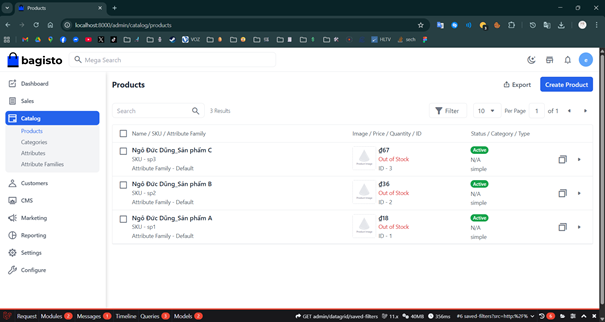
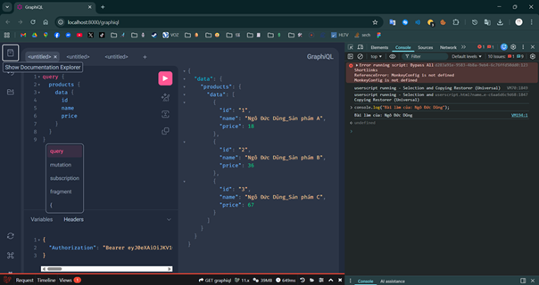
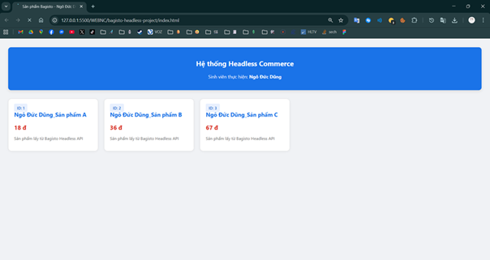

# BÁO CÁO THỰC HÀNH: XÂY DỰNG HỆ THỐNG HEADLESS COMMERCE VỚI BAGISTO

**Sinh viên thực hiện:** Ngô Đức Dũng  
**Mã số sinh viên:** 23810310264    
 **Công nghệ sử dụng:** Bagisto Core, GraphQL API, JWT Authentication, HTML5/CSS3/JavaScript.

---

## 1. Tổng quan hệ thống
Dự án thực hiện chuyển đổi nền tảng thương mại điện tử **Bagisto** truyền thống sang mô hình **Headless Commerce**. Bằng cách tách biệt phần quản trị dữ liệu (Backend) và giao diện hiển thị (Frontend), hệ thống giao tiếp thông qua lớp trung gian **GraphQL API**, giúp tăng tính linh hoạt và hiệu năng cho ứng dụng.

---

## 2. Các bước thực hiện và Giải quyết vấn đề

### Bước 1: Khởi tạo nền tảng Bagisto
* Cài đặt thành công Bagisto phiên bản mới nhất.
* **Xử lý lỗi Timezone:** Khắc phục lỗi `Unknown or bad timezone (Asia)` bằng cách cấu hình lại múi giờ chuẩn `Asia/Ho_Chi_Minh` trong file `.env`.

### Bước 2: Triển khai Headless API & Bảo mật
* Cài đặt gói mở rộng `bagisto/graphql-api`.
* Cấu hình **JWT (JSON Web Token)** bằng lệnh `php artisan jwt:secret` để bảo mật các điểm cuối (endpoints) của API.
* **Xử lý lỗi CORS:** Cấu hình file `config/cors.php` để cho phép ứng dụng Frontend (chạy trên cổng khác) có thể truy xuất dữ liệu từ server Bagisto.

### Bước 3: Quản trị sản phẩm
* Đăng nhập Admin và khởi tạo 03 sản phẩm thực tế với tên định danh cá nhân: **Ngô Đức Dũng_Sản phẩm A/B/C**.

### Bước 4: Kiểm thử API qua GraphiQL
* Sử dụng Mutation `userLogin` để thực hiện đăng nhập và lấy `accessToken`.
* Sử dụng Query `products` kết hợp với Headers Authorization để lấy danh sách sản phẩm.

---

## 3. Hình ảnh minh chứng (Screenshots)

### 📸 Minh chứng 1: Quản trị sản phẩm trong Admin Bagisto
Hiển thị danh sách 03 sản phẩm đã được tạo thành công với tên sinh viên.

### 📸 Minh chứng 2: Truy vấn dữ liệu qua GraphiQL Playground
Thực hiện Query thành công dữ liệu JSON và xác thực danh tính qua Console log.

### 📸 Minh chứng 3: Giao diện Frontend hiển thị sản phẩm
Trang web độc lập kết nối API và hiển thị sản phẩm lên giao diện người dùng.

---

## 4. Kết luận
Hệ thống đã hoạt động đúng theo yêu cầu của bài thực hành. Toàn bộ dữ liệu sản phẩm được quản lý tập trung tại Backend Bagisto và được phân phối an toàn qua GraphQL API đến ứng dụng Frontend.